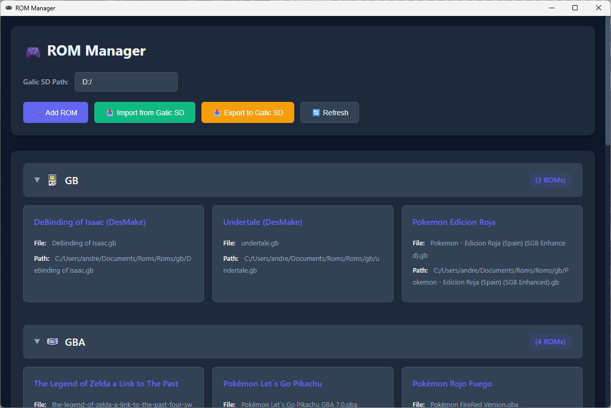

# 🎮 ROM Manager

A modern retro desktop application to organize, synchronize, scrape, and play retro game ROM collections across multiple consoles.




---

## 🌟 Key Features

### 🕹️ ROM Library Management
- **Multi-Console Support**: 18+ retro systems from NES to Nintendo Switch.
- **Smart System Classification**: Automatic console identification based on file extensions.
- **Custom Collections & Tags**: Group ROMs across consoles using custom tags.
- **Real-Time Search**: Instant filtering by game title and filename.
- **Saves & Manuals Support**: Link save states (`.sav`, `.srm`, `.state`) and view integrated PDF manuals.

### 📺 Big Picture Mode (TV & Gamepad)
- **Gamepad Navigation**: Native controller support via Web Gamepad API with rising-edge detection and hold-repeat.
- **Spatial Grid Navigation**: Seamless directional movement across console lists and game cards.
- **Keyboard Controls**: Arrow keys, Enter, and Escape support.
- **Cursor Auto-Hide**: Mouse cursor automatically disappears after 3 seconds of inactivity.

### 💾 Flexible Storage & Portability
- **Internal vs External Storage**: Store your library on local drives or directly on SD cards / external drives.
- **Portable Database**: External mode stores the JSON database directly on the portable storage for plug-and-play across different PCs.

### 🔄 Multi-Device Synchronization
- **SD Card Sync**: Bidirectional PC ↔ SD card file synchronization.
- **EmulationStation / ES-DE Sync**: Automated generation and updating of `gamelist.xml` metadata and relative cover art paths.
- **Android ADB Wireless & USB Sync**: Connect to Android retro handhelds (Retroid Pocket, AYN Odin, Anbernic, etc.) over Wi-Fi or USB. Features automated ADB platform-tools acquisition, library diffing, and progress tracking.

### 🌐 Metadata Scraping
- **ScreenScraper & TheGamesDB**: Automated scraping of titles, descriptions, developer information, release dates, and box art.

### 🚀 Direct Launch & Library Backup
- **Direct Emulator Launch**: Configure emulator paths per console and launch games directly from the app.
- **Backup & Restore**: Create full ZIP archives of your ROMs, saves, covers, and database for easy restoration.

---

## 💻 Installation & Setup

### Prerequisites
- **Node.js**: v18 or higher
- **npm** or package manager of choice

### Clone & Install

```bash
git clone https://github.com/andreakinder/RomsManager.git
cd RomsManager
npm install
```

### Running in Development

```bash
npm start
```

### Testing

```bash
npm test
npm run test:watch
npm run test:coverage
```

### Building & Packaging

```bash
# Package for current OS
npm run package

# Build installers (AppImage, deb, exe, zip)
npm run make

# Verify build configuration
npm run verify-build
```

---

## 📁 Storage Structure

```
<RomsBasePath>/
├── Roms/
│   ├── nes/
│   │   ├── SuperMarioBros.nes
│   │   └── gamelist.xml       # Generated if EmulationStation sync is enabled
│   ├── snes/
│   ├── gba/
│   └── ...
├── Saves/
│   ├── nes/
│   └── ...
├── Covers/
│   ├── nes/
│   └── ...
├── Manuals/
│   ├── nes/
│   └── ...
└── database/                 # Present when using External Storage mode
    ├── nes.json
    └── ...
```

---

## 🗂️ Supported Systems

| Console | System ID | File Extensions |
|---------|-----------|-----------------|
| NES / Famicom | `nes` | `.nes` |
| Super Nintendo (SNES) | `sfc` | `.smc`, `.sfc` |
| Sega Genesis / Mega Drive | `genesis` | `.md`, `.gen`, `.sms` |
| Sega CD | `sega_cd` | `.ccd`, `.cue`, `.iso` |
| Game Boy | `gb` | `.gb` |
| Game Boy Color | `gbc` | `.gbc` |
| Game Boy Advance | `gba` | `.gba` |
| Nintendo 64 | `n64` | `.z64`, `.v64`, `.n64` |
| Nintendo DS | `nds` | `.nds` |
| Nintendo 3DS | `3ds` | `.3ds`, `.cia` |
| GameCube | `gc` | `.gcm`, `.iso`, `.gcz` |
| Wii | `wii` | `.iso`, `.wbfs`, `.wad` |
| Wii U | `wiiu` | `.wud`, `.wux`, `.rpx` |
| Nintendo Switch | `switch` | `.nsp`, `.xci`, `.nca`, `.nro` |
| PlayStation 1 | `ps` | `.pbp`, `.bin`, `.cue`, `.iso` |
| PlayStation 2 | `ps2` | `.bin`, `.cue`, `.iso` |
| PlayStation Portable | `psp` | `.iso`, `.cso`, `.psp` |
| Neo Geo | `neogeo` | `.zip` |

---

## 🛠️ Tech Stack

- **Desktop Framework**: [Electron 44](https://www.electronjs.org/) + [Electron Forge](https://www.electronforge.io/)
- **UI Library**: [React 19](https://react.dev/)
- **Icons**: [Tabler Icons React](https://tabler.io/icons)
- **Styling**: Retro Dark Aesthetic + [nes.css](https://nostalgic-css.github.io/NES.css/) + Pixel Art Fonts (Press Start 2P)
- **Bundler**: Webpack 5
- **Services**: Axios, xml2js, Adm-Zip, Child Process ADB Bridge

---

## 📚 Documentation

For deeper architectural details, check the guides in [`docs/`](docs/):
- [Architecture Overview](docs/architecture.md)
- [Big Picture Mode & Gamepad](docs/big-picture-mode.md)
- [React Components](docs/components.md)
- [Hooks & Backend Services](docs/hooks-and-utils.md)
- [Retro Design System](docs/retro-design.md)
- [Code Conventions](docs/conventions.md)
- [Standard Commits](docs/standard-commits.md)

---

## 📄 License

This project is licensed under the [MIT License](LICENSE).
