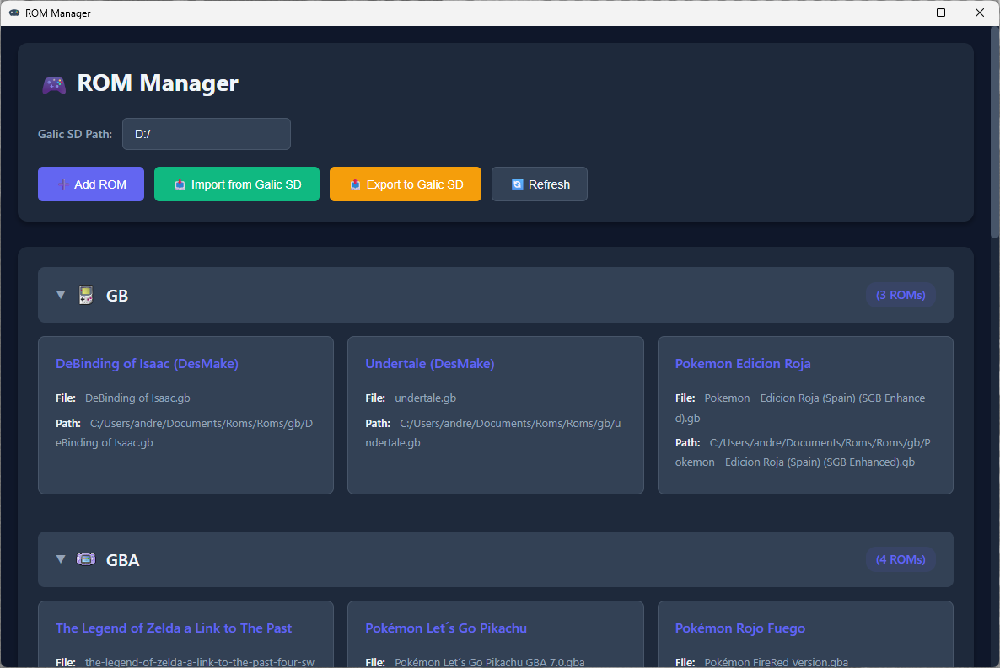

# 🎮 ROM Manager

Una aplicación de escritorio moderna para gestionar colecciones de ROMs de juegos retro en múltiples sistemas de consola.




## Características

✅ **Soporte Multi-Consola**: Gestiona ROMs para más de 16 sistemas de juegos retro  
✅ **Importación desde Tarjeta SD**: Importa ROMs directamente desde tarjetas SD o discos externos  
✅ **Detección Inteligente**: Detección automática del sistema basada en extensiones de archivo  
✅ **Almacenamiento Organizado**: ROMs organizadas por sistema de consola con metadatos JSON  
✅ **Interfaz Moderna**: Interfaz limpia con tema oscuro y estética de juegos retro  
✅ **Gestión de Archivos**: Añade ROMs individuales o importa colecciones completas en masa  
✅ **Edición de ROMs**: Edita títulos y metadatos de ROMs con editor en línea  
✅ **Soporte de Carátulas**: Muestra imágenes de carátula personalizadas para cada ROM  
✅ **Gestión de Partidas**: Importa, exporta y gestiona archivos de guardado para tus ROMs  
✅ **Estilo Retro**: Fuente pixel-art y efectos visuales retro para una experiencia auténtica  
✅ **Exportación Rápida**: Funcionalidad de exportación de ROMs y archivos de guardado con un clic  
✅ **Búsqueda de Juegos**: Encuentra ROMs rápidamente buscando títulos con filtrado en tiempo real  
✅ **Soporte de Manuales PDF**: Importa y visualiza manuales de juegos en formato PDF  

## Próximas Características

🔜 **Vista de Galería**: Navega tu colección de ROMs con diseños de cuadrícula visual  
🔜 **Metadatos Extendidos**: Rastrea descripción, idiomas, año de lanzamiento y editorial  
🔜 **Información de Jugadores**: Registra el número de jugadores para cada juego  
🔜 **Valoraciones de Juegos**: Sistema de valoración personal y puntuaciones de dificultad  
🔜 **Notas de Juegos**: Añade notas personales y comentarios para cada ROM  

## Capturas de Pantalla

### Interfaz Principal
- Visualiza todas tus colecciones de ROMs organizadas por consola
- Secciones de consola expandibles/colapsables
- Insignias con el contador de ROMs para cada sistema

### Características
- **Añadir ROM**: Selecciona e importa archivos ROM individuales
- **Importar desde SD**: Importación masiva de ROMs desde tarjeta SD o disco externo
- **Actualizar**: Recarga las colecciones de ROMs

## Instalación

### Requisitos Previos

- Node.js 18+ 
- npm o yarn

### Configuración

```bash
# Clonar el repositorio
git clone https://github.com/yourusername/RomsManager.git
cd RomsManager

# Instalar dependencias
npm install

# Iniciar servidor de desarrollo
npm start

# Compilar para producción
npm run package
```

## Uso

### Configuración Inicial

1. **Inicia la aplicación**
2. **Configura la Ruta SD**: Introduce la letra de unidad de tu tarjeta SD (ej., `D:/`, `E:/`)
3. **Importa ROMs**: Haz clic en "📥 Importar desde SD" para importar tu colección de ROMs

### Añadir ROMs Individuales

1. Haz clic en **"➕ Añadir ROM"**
2. Navega y selecciona un archivo ROM desde cualquier lugar de tu PC
3. La ROM será automáticamente:
   - Copiada a la carpeta del sistema apropiado
   - Registrada en los metadatos JSON del sistema
   - Mostrada en la interfaz

### Importar desde Tarjeta SD

1. Inserta tu tarjeta SD
2. Establece la letra de unidad correcta en el campo **Ruta SD**
3. Haz clic en **"📥 Importar desde SD"**
4. Todas las ROMs serán importadas y organizadas por sistema

### Gestionar tu Colección

#### Buscar Juegos
1. Usa la barra de búsqueda **🔍 Buscar juegos** en el encabezado
2. Escribe cualquier parte del título de un juego para filtrar tu colección
3. Los resultados de búsqueda se actualizan en tiempo real mientras escribes
4. El pie de página muestra el contador filtrado (ej., "Mostrando: 15")
5. Haz clic en el botón **✕** para limpiar la búsqueda y mostrar todas las ROMs
6. La búsqueda funciona en todas las consolas simultáneamente

**Características de Búsqueda:**
- Búsqueda sin distinción entre mayúsculas y minúsculas
- Busca tanto en títulos de ROM como en nombres de archivo
- Solo muestra consolas con ROMs coincidentes
- Muestra el mensaje "No se encontraron juegos" si no hay coincidencias

#### Navegar ROMs
- Haz clic en cualquier encabezado de consola para expandir/colapsar la lista de ROMs
- Cada tarjeta de ROM muestra:
  - Título de la ROM con fuente pixel-art retro
  - Carátula personalizada (si está disponible)
  - Indicador de archivo de guardado (💾) si existe una partida
  - Botones de acción para editar, eliminar y exportar

#### Editar ROMs
1. Haz clic en el botón **✏️ Editar** en cualquier tarjeta de ROM
2. Modifica el título de la ROM
3. Selecciona una imagen de carátula (PNG, JPG, GIF, WebP)
4. Importa un archivo de guardado si está disponible
5. Haz clic en **Guardar** para aplicar los cambios

#### Gestionar Archivos de Guardado
- **Ver Estado de Guardado**: Las ROMs con archivos de guardado muestran un icono 💾
- **Exportar Guardado**: Haz clic en el icono 💾 para exportar el archivo de guardado
- **Importar Guardado**: Usa el modal de Edición para importar archivos de guardado desde tu PC

#### Exportar ROMs
- Haz clic en el botón **⬇️ Descargar** en cualquier tarjeta de ROM
- Elige la ubicación de exportación
- El archivo ROM se copia al directorio seleccionado

## Sistemas Soportados

| Consola | Extensiones |
|---------|-----------|
| NES | `.nes` |
| SNES/SFC | `.smc`, `.sfc` |
| Sega Genesis | `.md`, `.gen`, `.sms` |
| Game Boy | `.gb` |
| Game Boy Color | `.gbc` |
| Game Boy Advance | `.gba` |
| Nintendo 64 | `.z64`, `.v64`, `.n64` |
| Nintendo DS | `.nds` |
| PlayStation 1 | `.bin`, `.cue`, `.iso`, `.pbp` |
| PlayStation 2 | `.bin`, `.cue`, `.iso` |
| GameCube | `.gcm`, `.iso`, `.gcz` |
| Wii | `.iso`, `.wbfs`, `.wad` |
| Nintendo 3DS | `.3ds`, `.cia` |
| Wii U | `.wud`, `.wux`, `.rpx` |
| Nintendo Switch | `.nsp`, `.xci`, `.nsz` |

## Estructura del Proyecto

```
RomsManager/
├── src/
│   ├── back/                    # Servicios de backend
│   │   ├── data/
│   │   │   └── consoles.json    # Definiciones de consolas
│   │   └── services/
│   │       ├── syncService.js   # Lógica de importación/exportación
│   │       └── uiDataService.js # Agregación de datos
│   ├── renderer/                # Frontend React
│   │   ├── assets/
│   │   │   └── fonts/           # Fuentes de juegos retro
│   │   ├── components/
│   │   │   └── roms/
│   │   │       ├── RomCard.jsx  # Componente de visualización de ROM
│   │   │       └── EditRomModal.jsx # Modal de edición de ROM
│   │   └── App.jsx
│   ├── window/
│   │   ├── main.js             # Proceso principal de Electron
│   │   └── preload.js          # Puente IPC
│   └── styles/
│       └── index.css           # Estilos globales con tema retro
├── docs/
│   └── ARCHITECTURE.md         # Documentación detallada de arquitectura
└── README.md
```

## Ubicaciones de Almacenamiento

### Almacenamiento en PC

Las ROMs se almacenan en:
```
C:/Users/{usuario}/Roms/
├── Json/           # Metadatos para cada sistema (título, rutas, etc.)
├── Covers/         # Imágenes de carátula para ROMs
├── Saves/          # Archivos de guardado organizados por consola
├── gb/             # ROMs de Game Boy
├── gba/            # ROMs de Game Boy Advance
├── ps/             # ROMs de PlayStation 1
└── ...
```

#### Estructura de Metadatos (JSON)
Cada consola tiene un archivo JSON almacenando metadatos de ROM:
```json
{
  "romName.gba": {
    "title": "Título del Juego",
    "romName": "romName.gba",
    "romPath": "C:/Users/.../Roms/gba/romName.gba",
    "coverPath": "C:/Users/.../Roms/Covers/gba/romName.png",
    "savePath": "C:/Users/.../Roms/Saves/gba/romName.sav"
  }
}
```

### Estructura de Tarjeta SD

Estructura esperada de la tarjeta SD:
```
{UNIDAD_SD}/Roms/
├── GB/             # Nombres de directorio en MAYÚSCULAS
├── GBA/
├── PS/
└── ...
```

**Importante**: Los directorios de la tarjeta SD deben usar nombres en **MAYÚSCULAS** (ej., `GB`, `PS`, `GBA`).

## Desarrollo

### Scripts

```bash
npm start          # Iniciar modo desarrollo
npm run package    # Compilar distribuible
npm run make       # Crear instalador
npm test           # Ejecutar pruebas
npm run lint       # Linter de código
```

### Stack Tecnológico

- **Electron 39**: Framework de aplicaciones de escritorio
- **React 19**: Biblioteca de interfaz de usuario
- **Webpack**: Empaquetador de módulos
- **Electron Forge**: Herramientas de compilación
- **Better-SQLite3**: Base de datos para metadatos de ROM
- **xml2js**: Análisis XML para metadatos de juegos
- **Fuente Press Start 2P**: Tipografía pixel-art retro
- **Módulos ES**: Módulos JavaScript modernos

## Configuración

### Personalizar Rutas de Almacenamiento

Edita `src/back/services/utils/getPaths.js`:

```javascript
export function getRomPathPC(consoleId, romFileName) {
  return `C:/Tu/Ruta/Personalizada/Roms/${consoleId}/${romFileName}`;
}
```

### Añadir Nuevos Sistemas de Consola

Edita `src/back/data/consoles.json`:

```json
{
  "NuevaConsola": {
    "id": "17",
    "id_name": "nuevaconsola",
    "name": "Nombre de Nueva Consola",
    "file": [".ext1", ".ext2"]
  }
}
```

## Solución de Problemas

### Las ROMs No Se Importan

1. **Verifica la Ruta SD**: Asegúrate de que la letra de unidad sea correcta
2. **Nombres de Directorio**: Los directorios SD deben estar en MAYÚSCULAS
3. **Extensiones de Archivo**: Verifica que las extensiones coincidan con los formatos soportados
4. **Permisos**: Asegúrate de tener permisos de lectura/escritura para los directorios de almacenamiento

### Sistema No Detectado

1. **Extensión de Archivo**: Verifica si la extensión de la ROM está soportada
2. **Definiciones de Consola**: Verifica que el sistema existe en `consoles.json`
3. **Formato de Extensión**: Las extensiones deben incluir el punto (ej., `.gb` no `gb`)

### Las Imágenes de Carátula No Se Muestran

1. **Formato de Archivo**: Asegúrate de que la carátula sea PNG, JPG, GIF o WebP
2. **Permisos de Archivo**: Verifica los permisos de lectura en los archivos de carátula
3. **Validación de Ruta**: Verifica que la ruta de la carátula esté correctamente almacenada en los metadatos JSON

### Los Archivos de Guardado No Se Cargan

1. **Ruta de Guardado**: Asegúrate de que el archivo de guardado existe en la ruta especificada
2. **Extensión de Archivo**: Extensiones comunes: `.sav`, `.srm`, `.dat`, `.state`
3. **Proceso de Importación**: Usa el modal de Edición para importar correctamente los archivos de guardado

## Contribuir

¡Las contribuciones son bienvenidas! Por favor:

1. Haz un fork del repositorio
2. Crea una rama de característica
3. Haz commit de tus cambios
4. Haz push a la rama
5. Abre un Pull Request

## Licencia

Licencia MIT - Ver archivo LICENSE para detalles

## Créditos

- Construido con [Electron](https://www.electronjs.org/)
- Interfaz potenciada por [React](https://react.dev/)
- Empaquetado con [Electron Forge](https://www.electronforge.io/)

## Soporte

Para problemas, preguntas o solicitudes de características, por favor abre un issue en GitHub.

---

**Hecho con ❤️ para entusiastas de los juegos retro**
